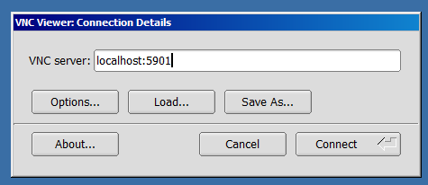
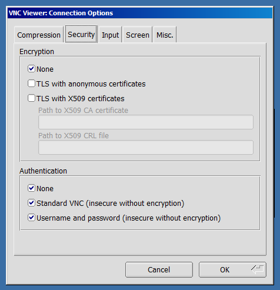

# Guide on how to setup your PC for Online Training

In the course of the training you will be working on a remote training server. In order to connect your
workstation/PC with this server please read this guide carefully.

NOTE for network administrators: No incoming ports on your firewall have to be opened. The attendees 
will be establishing outgoing connections via SSH (port 22) tunnels to the remote training server.

## Prerequisites
Before the training commences the teacher will provide you with:
- a user name and a password. The user name is usually something like "training2", "training3" etc.
- the IP of the remote training server like 45.154.144.35.

### Windows
Install the SSH client *Putty* from https://www.putty.org/ .
It is a standalone executable (*.exe) file which you can save to your Desktop.
<!-- place image of the desktop icon  -->

### Linux
Install a VNC viewer like *Tiger VNC* or the remote desktop client *Remmina*.
Both should come with mayor Linux distros.


## Set up the tunnels
Working on a remote server in graphical mode is based on the *VNC*, *noVNC* or *RDP* protocol. They use
the port numbers 5901, 5801 or 3389 respectively. Whatever protocol you will be using, it must be
tunneled from your location to the location of the training server. In our case we will setup
a tunnel for each protocol.
The protocol for the tunnel is SSH (port 22). So each protocols mentioned above will be wrapped in SSH.

### Windows
Start *Putty* and do the setup as depicted in the follwing screenshots.
In section *Session* enter in the red circled field the IP (given to you by the teacher) of the remote training server.


Go to section *Connection/SSH/Tunnels* and setup the three tunnels:
<!-- images of the procedure step by step -->


Go back to section *Session* and save the session as *Training*.

Click "open".
A console window opens. Enter your username and password.


Now you have three tunnels ready: One for *RDP*, one for *VNC* and a third for *noVNC*.
Leave the console window open. Once you close it, the connection with the remote server
will be cut !

### Linux
Open a terminal as a regular non-root user and type these commands which specify:
- the user name (e.g. training2),
- the IP of the remote training server

The tunnel for *VNC*:

```sh
$ ssh -L 5901:localhost:5901 training2@45.154.144.35
```
Now you are asked to login. Enter your username and password (as given by the teacher).

The tunnel for *noVNC*:
```sh
$ ssh -L 5801:localhost:5801 training2@45.154.144.35
```
Now you are asked to login. Enter your username and password (as given by the teacher).

Under *Linux* we don't need an *RDP* tunnel.


## Starting the remote session

### Operating system independed via webbrowser
Start a webbrowser like Firefox or Chromium and enter this web address: http://localhost:5801/


### Windows
#### Via RDP client
- Start the remote desktop client. It is built in in *Windows*.
- Enter the computer address 127.0.0.2:3389 :


- Login with your username and password:


- The session at the remote server opens:


You are now ready for the training !

#### Via VNC viewer
- Start the VNC viewer:



- Disable TLS:



- Login with your username and password:


- The session at the remote server opens:


You are now ready for the training !

### Linux
#### Via VNC viewer
Same as with Windows. See above.


